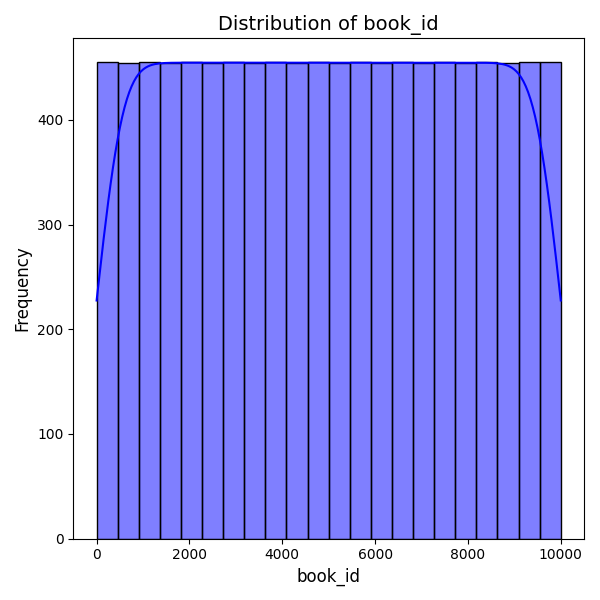
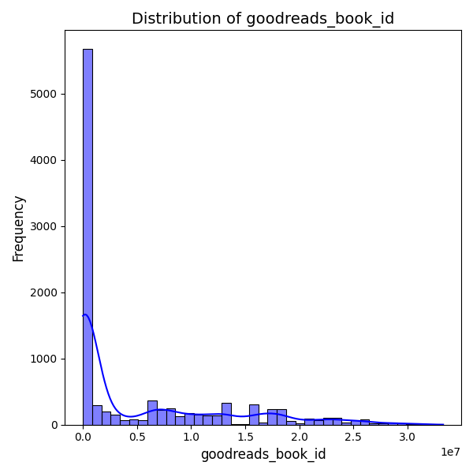
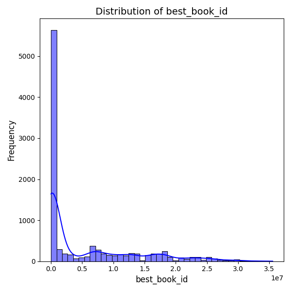
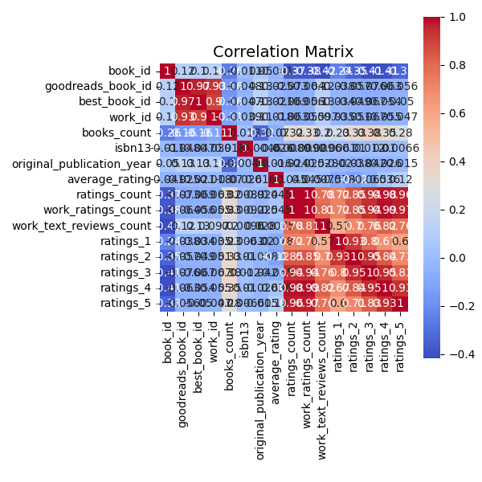

# Analysis Report

# Comprehensive Report on Book Dataset Analysis

## 1. Introduction
This report provides an in-depth analysis of a dataset containing information about 10,000 books. The dataset includes various attributes such as book identifiers, metadata about the authors, publication years, ratings, and review counts. The analysis aims to uncover insights that can inform decisions related to marketing, selection, and collection development for libraries, bookstores, or online platforms.

## 2. Dataset Overview
- **Shape**: (10,000 rows, 23 columns)
- **Key Attributes**:
  - **Identifiers**: `book_id`, `goodreads_book_id`, `best_book_id`, `work_id`
  - **Metadata**: `authors`, `original_publication_year`, `title`, `language_code`
  - **Ratings and Reviews**: `average_rating`, `ratings_count`, `work_ratings_count`, `work_text_reviews_count`
  - **ISBN**: `isbn`, `isbn13`

## 3. Missing Values
The dataset has several attributes with missing values, which could affect analysis:
- **ISBN**: 700 missing values
- **ISBN13**: 585 missing values
- **Original Publication Year**: 21 missing values
- **Original Title**: 585 missing values
- **Language Code**: 1084 missing values
- **Average Rating**: 0 missing values but crucial for understanding book quality

## 4. Summary Statistics
### Key Findings
- **Authors**: The dataset features 4,664 unique authors, with "Stephen King" being the most frequently cited (60 occurrences).
- **Publication Year**: The average original publication year is approximately 1982, with a range from -1750 to 2017, indicating historical diversity in book offerings.
- **Average Rating**: The mean average rating is around 4.00 (on a scale of 1 to 5), suggesting that most books have favorable reviews.

### Distribution of Ratings
- **Ratings Count**: The mean ratings count is 54,001, indicating a large number of user interactions with these books.
- **Work Ratings Count**: The mean is 59,687, suggesting that books typically receive a considerable number of reviews.

## 5. Correlation Analysis
### Key Correlations
- **Ratings Count and Work Ratings Count**: Highly correlated (0.995), indicating that books with more ratings

