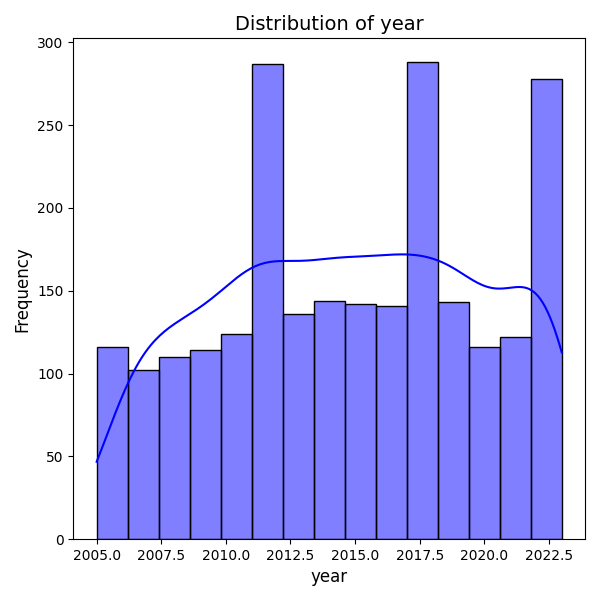

# Analysis Report

# Comprehensive Report on Dataset Analysis

## Overview
This report presents an analysis of a dataset containing 2,363 records across 11 variables related to various factors affecting life satisfaction, including economic indicators, social support, and perceptions of well-being. The dataset spans from the year 2005 to 2023, covering multiple countries.

## Dataset Structure
The dataset comprises the following columns:
- **Country name**: Categorical data representing the country
- **Year**: Numeric data indicating the year of the observation
- **Life Ladder**: A subjective measure of well-being or life satisfaction
- **Log GDP per capita**: A logarithmic transformation of GDP per capita, representing the economic standard of living
- **Social support**: A measure of perceived support from family and friends
- **Healthy life expectancy at birth**: An indicator of the average number of years a newborn is expected to live in good health
- **Freedom to make life choices**: A measure of individual freedom in decision-making
- **Generosity**: A measure of charitable giving and altruism
- **Perceptions of corruption**: A measure of the perceived level of corruption in the government
- **Positive affect**: A measure of positive emotions and moods
- **Negative affect**: A measure of negative emotions and moods

## Missing Values
The dataset contains several missing values across different columns:
- **Log GDP per capita**: 28 missing values
- **Social support**: 13 missing values
- **Healthy life expectancy at birth**: 63 missing values
- **Freedom to make life choices**: 36 missing values
- **Generosity**: 81 missing values
- **Perceptions of corruption**: 125 missing values
- **Positive affect**: 24 missing values
- **Negative affect**: 16 missing values

## Summary Statistics
The summary statistics reveal the following insights:

- **Life Ladder**: The mean score is approximately 5.48, indicating a moderate level of life satisfaction across countries. The scores range from 1.281 (low satisfaction) to 8.019 (high satisfaction).
- **Log GDP per capita**: The average is about 9.40, suggesting a reasonably high standard of living. The values range from 5.527 to 11.676.
- **Social Support**: The average social support score is approximately 0.81, indicating a generally

