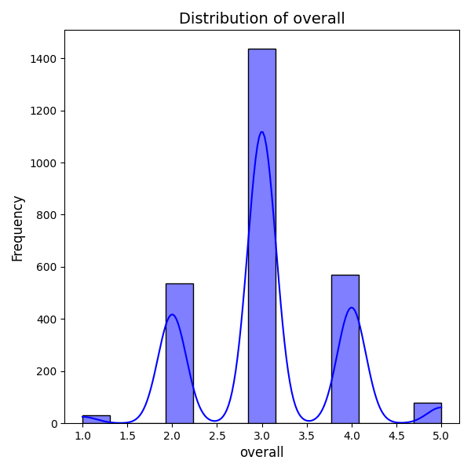
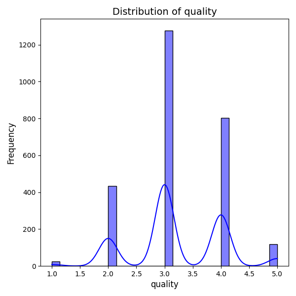
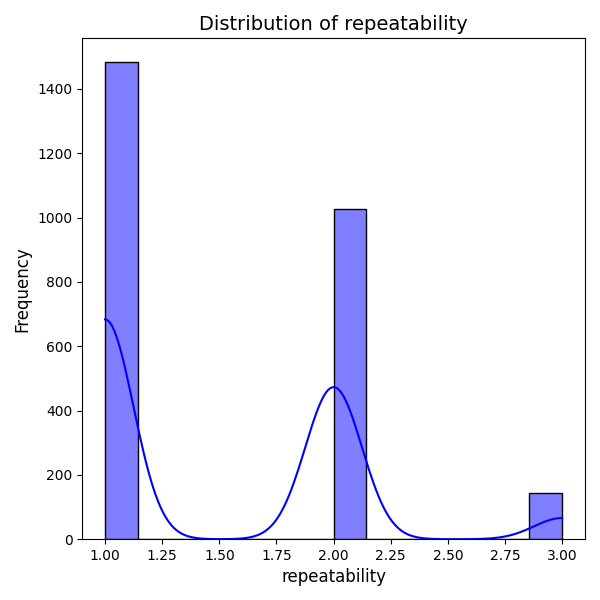
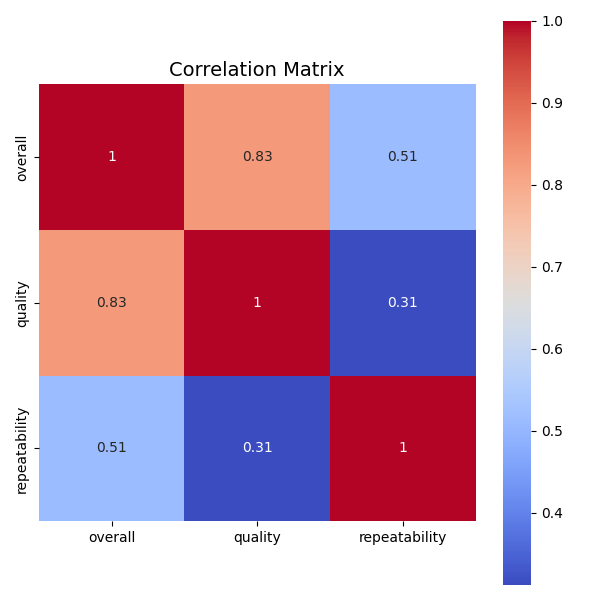

# Analysis Report

# Comprehensive Report on Dataset Analysis

## Overview
This report provides a detailed analysis of a dataset containing 2,652 records across 8 columns related to movies, reviews, and ratings. The focus is on the insights derived from summary statistics, correlation analysis, and the implications of the findings.

## Dataset Structure
- **Shape**: (2652, 8)
- **Columns**:
  - `date`: Date of the entry
  - `language`: Language of the movie
  - `type`: Type of the content (e.g., movie)
  - `title`: Title of the movie
  - `by`: Reviewer or contributor of the review
  - `overall`: Overall rating (int)
  - `quality`: Quality rating (int)
  - `repeatability`: Repeatability rating (int)

### Missing Values
The dataset contains the following missing values:
- `date`: 99 missing values
- `by`: 262 missing values

### Summary Statistics
Key statistics for the dataset are as follows:

| Column        | Count | Unique | Top                    | Frequency | Mean     | Std. Dev. |
|---------------|-------|--------|------------------------|-----------|----------|-----------|
| date          | 2553  | 2055   | 21-May-06              | 8         | N/A      | N/A       |
| language      | 2652  | 11     | English                | 1306      | N/A      | N/A       |
| type          | 2652  | 8      | movie                  | 2211      | N/A      | N/A       |
| title         | 2652  | 2312   | Kanda Naal Mudhal     | 9         | N/A      | N/A       |
| by            | 2390  | 1528   | Kiefer Sutherland      | 48        | N/A      | N/A       |
| overall       | 2652  | N/A    | N/A                    | N/A       | 3.05     | 0.76      |
| quality       | 2652  | N/A    | N/A                    | N/A       | 3.21     | 0.80      |
| repeatability  | 2652  | N/A    | N/A                    | N/A       | 1.49     |

